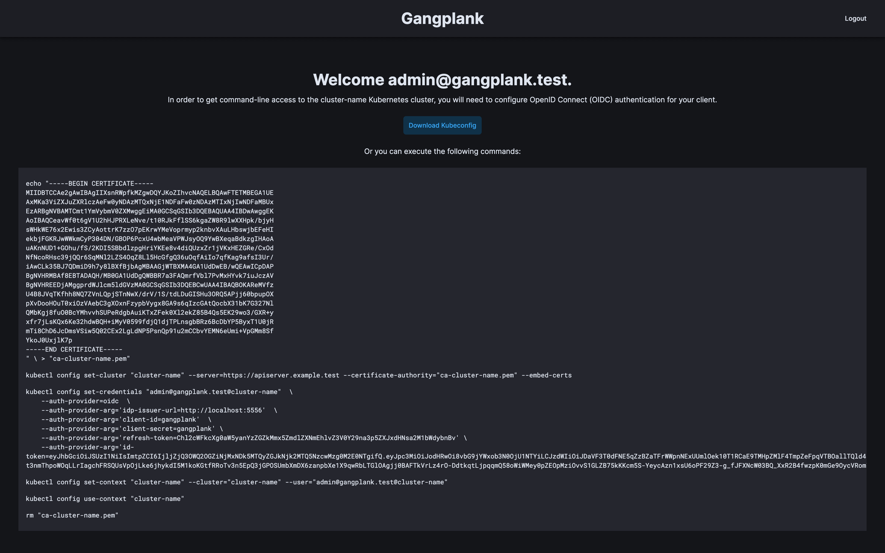

# Gangplank

_(noun): A board or ramp used as a removable footway between a ship and a pier._

Gangplank is a web application that allows users to authenticate with an OIDC provider and configure their `kubectl` configuration file with the [OpenID Connect Tokens](https://kubernetes.io/docs/reference/access-authn-authz/authentication/#openid-connect-tokens). Gangplank is based on [Gangway](https://github.com/vmware-archive/gangway), which is no longer maintained.



## Deployment

Gangplank can be deployed with Helm or with Kubernetes manifests.

The Helm chart can be found [here](deployments/helm/README.md).

Instructions for deploying with Kubernetes manifests can be found [here](docs/README.md).

## How It Works

Kubernetes supports OpenID Connect (OIDC) as a user authentication mechanism. OIDC is an
authentication protocol that allows servers to verify the identity of a user by way of an ID Token.

When using OIDC to authenticate with Kubernetes, the client (e.g. `kubectl`) sends the ID token
alongside all requests to the API server. On the server side, the Kubernetes API server verifies the
token to ensure it is valid and has not expired. Once verified, the API server extracts username and
group membership information from the token, and continues processing the request.

In order to obtain the ID token, the user must go through the OIDC authentication process. This is
where Gangplank comes in. Gangplank is a web application that enables the OIDC authentication flow which
results in the minting of the ID Token.

Gangplank is configured as a client of an upstream Identity Service that speaks OIDC. To obtain the ID
token, the user accesses Gangplank, initiates the OIDC flow by clicking the "Log In" button, and
completes the flow by authenticating with the upstream Identity Service. The user's credentials are
never shared with Gangplank.

Once the authentication flow is complete, the user is redirected to a Gangplank page that provides
instructions on how to configure `kubectl` to use the ID token.

The following sequence diagram details the authentication flow:

<p align="center">
    
</p>

## Kubernetes API Server

Gangplank requires that the Kubernetes API server is configured to use OIDC for authentication, check the following link for more information: https://kubernetes.io/docs/reference/access-authn-authz/authentication/#configuring-the-api-server

## Build

The project uses [asdf](https://github.com/asdf-vm/asdf) to manage the build tools. After installing the required tools, the following command will build the Gangplank binary and the container image:

```bash
make build
```
