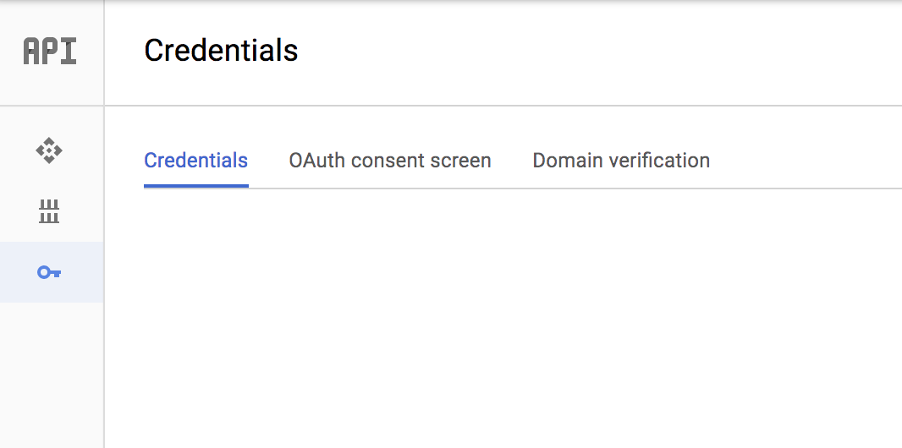
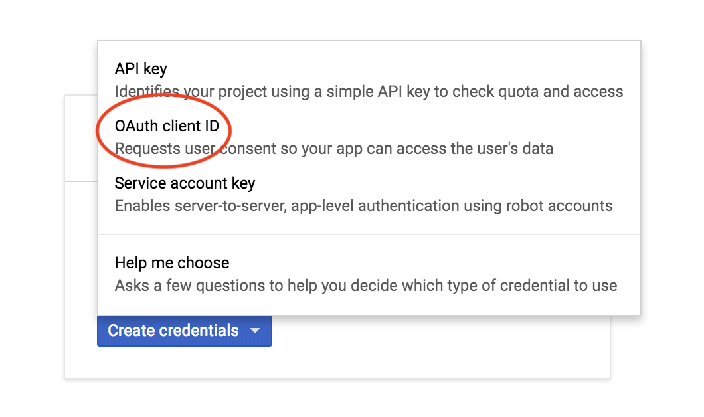

# Connecting gangplank to Google

It is possible to use Google as an OAuth provider with gangplank. To do so follow the instructions below:

## Setting Up Google OAuth

- Head to Credentials area of Google Cloud: `https://console.cloud.google.com/apis/credentials?project=<your-google-cloud-project-name>`.
  If previously you haven't created any credentials, you should see an empty list



- In that page, click on "Create credentials". A menu will pop-over. From that menu click on "OAuth client ID".



- In the page you will land, choose "Web application" for the type, then give the oath client id a name and fill in the the callback url appropriately, then click "Create".


- If successful, you'll be prompted in the modal window if you want to copy the client id and secret. Click "OK" to close.

- In the list, you should see the credentials we just created. To the right, there are 3 action icons. Click on the downward "download" arrow.

## Configuring gangplank

You now need to configure gangplank.
Here is a typical config file:

```yaml
# Your Cluster Name. There's no strict mapping, so it can be anything
clusterName: "your_cluster_name"

# The URL to send authorize requests to
# leave as is unless Google instructs you otherwise
authorizeUrl: "https://accounts.google.com/o/oauth2/auth"

# URL to get a token from
# leave as is unless Google instructs you otherwise
#
# kube-apiserver 1.10+
# the OpenID Connect authenticator no longer accepts tokens from the Google v3 token APIs; users must switch to the "https://www.googleapis.com/oauth2/v4/token" endpoint.
tokenUrl: "https://accounts.google.com/o/oauth2/token"

# API Client ID. Get from Google credentials "client_id" field
clientId: "12345678901234567890.apps.googleusercontent.com"

# API Client Secret. Get from Google credentials "client_secret" field
clientSecret: "FRGegerwgfsFE_fefdsf"

# Endpoint that provides user profile information.
# For Google's purpose is the same as your client_id
audience: "923798723208-9pq62pkrnbhumipnqs4v0a1iu7ij01fo.apps.googleusercontent.com"

# Where to redirect back to. This should be a URL
# Where gangplank is reachable. Cannot be a raw IP address. Must be a valid TLD.
redirectUrl: "https://url.kuberneters.cluster.com/callback"

# Used to specify the scope of the requested authorisation in OAuth.
# Unlike with Auth0, we do not need "offline"
scopes: ["openid", "profile", "email"]

# What field to look at in the token to pull the username from, leave as is
usernameClaim: "sub"

# What field to look at in the token to pull the email from, leave as is
emailClaim: "email"

# The API server to use when configuring kubectl for the user
apiServerURL: "https://kube-apiserver.yourcluster.com"
```
